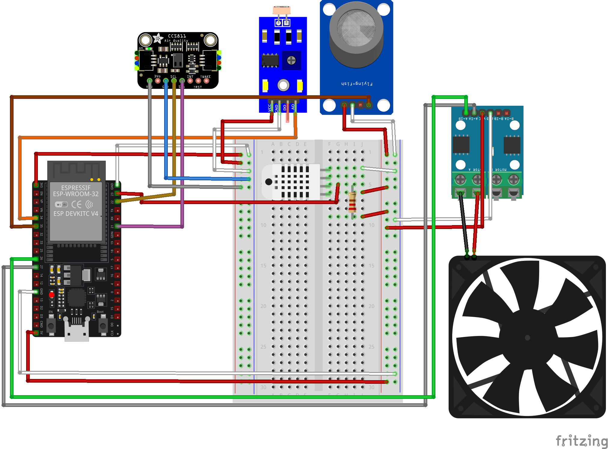
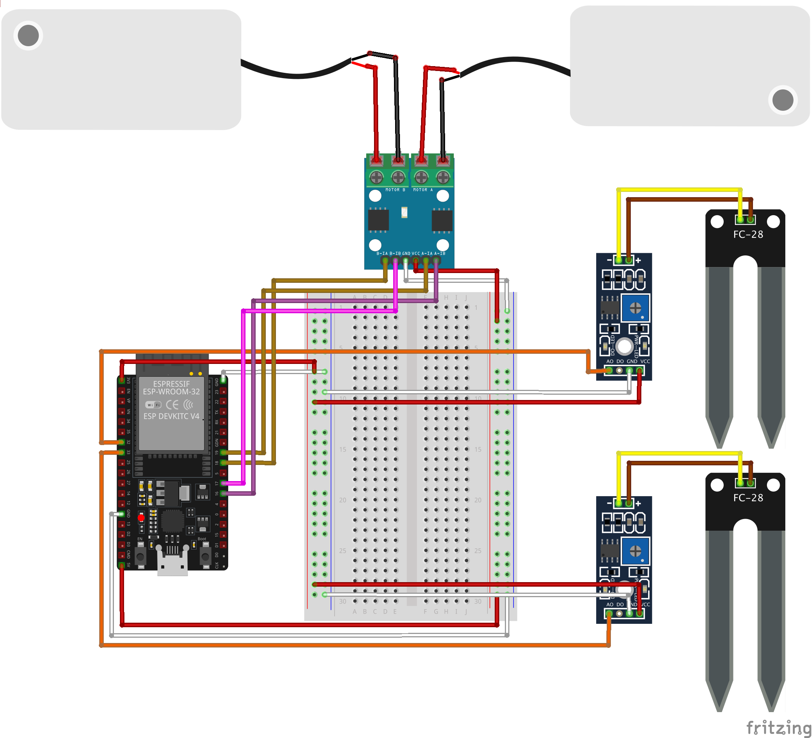

# SmartFarm Infrastructure with Metaverse

Experience farming anywhere with SFIM! You can check and cultivate your actual farm on Roblox!

See the full detail of this project on our [hackster.io](https://www.hackster.io/rudgh9242/smart-farm-infrastructure-with-metaverse-373664)

All devices in this app is powered by oneM2M

This app utilizes [**Mobius**](https://github.com/IoTKETI/Mobius) as IN-CSE and MN-CSE

For further information about oneM2M visit [onem2m webpage](https://www.onem2m.org)
 

## Hardware

This program is coded, built, uploaded with Arduino IDE. 

The chip used is ESP32 Dev Board.

### Libraries needed

- Arduino_JSON
- AsyncMQTT_ESP32
- DHT sensor library
- WiFiManager

### Sensors

- DHT22
- MQ135
- CCS811
- HG7881
- DM460

### 1) House Device

House device collects following datas.

- Temperature
- Humidity
- AirQuality
- Luminance
- CO2
- TVOC

House device has following actuator

- Fan

**Usage**
1. Build and upload house.ino file to ESP32 Dev Board.
2. When Booting, you can find a WiFi with ChipName set in the script.
3. Press Configure and input SSID and password of the WiFi you want to connect the device into
4. Input IN-CSE name, MN-CSE name, MN-CSE host address and press save.
5. Wait a few seconds and the device would start updating the Sensors

### 2) Plant Device

Plant device collects following data.

- Soil Moisture

Plant device has following actuator
- WaterPump
- Light control

**Usage**
1. Build and upload plant.ino file to ESP32 Dev Board.
2. When Booting, you can find a WiFi with ChipName set in the script.
3. Press Configure and input SSID and password of the WiFi you want to connect the device into
4. Input IN-CSE name, MN-CSE name, MN-CSE host address and chip_no. Note that chip_no is used to make AE 
(chip_no 0 register moistureSensor0, moistureSensor1. chip_no 1 registers moistureSensor2, moistureSensor3)
5. Wait a few seconds and the device would start updating the Sensors
